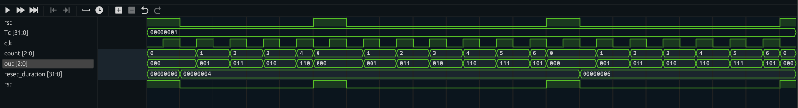

# Gray-Code-Verification

## Checklist
- [x] design
- [x] top
- [x] generator
- [x] driver
- [x] environment
- [x] transaction
- [x] interface
- [x] test
- [x] monitor
- [x] scoreboard

## Todo
- [ ] Print the output properly

## Status
- Current Waveform:- (for reset_duration = 7)

<details><summary><b><code>Current output:- </code></b></summary>
Simulation:<br>
<code>
============= Generating =============
-------------------------
 Generator 
-------------------------
reset_duration = 7
count = xxx, out = xxx
-------------------------
-------------------------
 Driver 
-------------------------
reset_duration = 7
count = 000, out = 000
-------------------------
-------------------------
 Driver for rst 
-------------------------
reset_duration = 7
count = 000, out = 000
-------------------------
=============== Testing ===============
-------------------------
 Monitor 
-------------------------
reset_duration = 0
count = 011, out = 010
-------------------------
Result is correct
-------------------------
 Scoreboard 
-------------------------
reset_duration = 0
count = 011, out = 010
-------------------------
=============== Testing ===============
-------------------------
 Monitor 
-------------------------
reset_duration = 0
count = 101, out = 111
-------------------------
Result is correct
-------------------------
 Scoreboard 
-------------------------
reset_duration = 0
count = 101, out = 111
-------------------------
=============== Testing ===============
-------------------------
 Monitor 
-------------------------
reset_duration = 0
count = 000, out = 000
-------------------------
Result is correct
-------------------------
 Scoreboard 
-------------------------
reset_duration = 0
count = 000, out = 000
-------------------------
=============== Testing ===============
-------------------------
 Monitor 
-------------------------
reset_duration = 0
count = 010, out = 011
-------------------------
Result is correct
-------------------------
 Scoreboard 
-------------------------
reset_duration = 0
count = 010, out = 011
-------------------------
</code>
</details>

# Diagram
```
 [Reset Duration]                                                           
    ┌──────┐                                                                
    │Packet│                                                                
    └───┬──┘                                                                
        │                                                                   
        │                                                                   
        │                                                                   
   ┌────▼────┐                        Mailbox            Mailbox            
   │Generator│                           │                  │               
   └────┬────┘             ┌─────────┐   │    ┌─────────┐   │   ┌──────────┐
        │                  │Monitor_1├───┴────►Reference├───┴───►Scoreboard│
        │                  └───▲─────┘        │ Model   │       └────▲─────┘
        │Mailbox               │              └─────────┘            │      
        │                      │Virtual Interface                    │      
    ┌───▼──┐              ┌────┴────────────┐                        │      
    │Driver├──────────────►    Interface    │                    ┌───┴─────┐
    └──────┘Virtual       │   ┌─────────┐   ├────────────────────►Monitor_2│
           Interface      │   │         │   │      Virtual       └─────────┘
                          │   │ ┌─────┐ │   │     Interface                 
                          │   ├─► DUT ├─►   │                               
                          │   │ └▲────┘ │   │                               
                          └─▲─┘  │      └───┘                               
                            │    │                                          
                            │    │ Virtual                                  
                           ┌┴────┴┐Interface                                
                           │ clk  │                                         
                           └──────┘                                         
```
